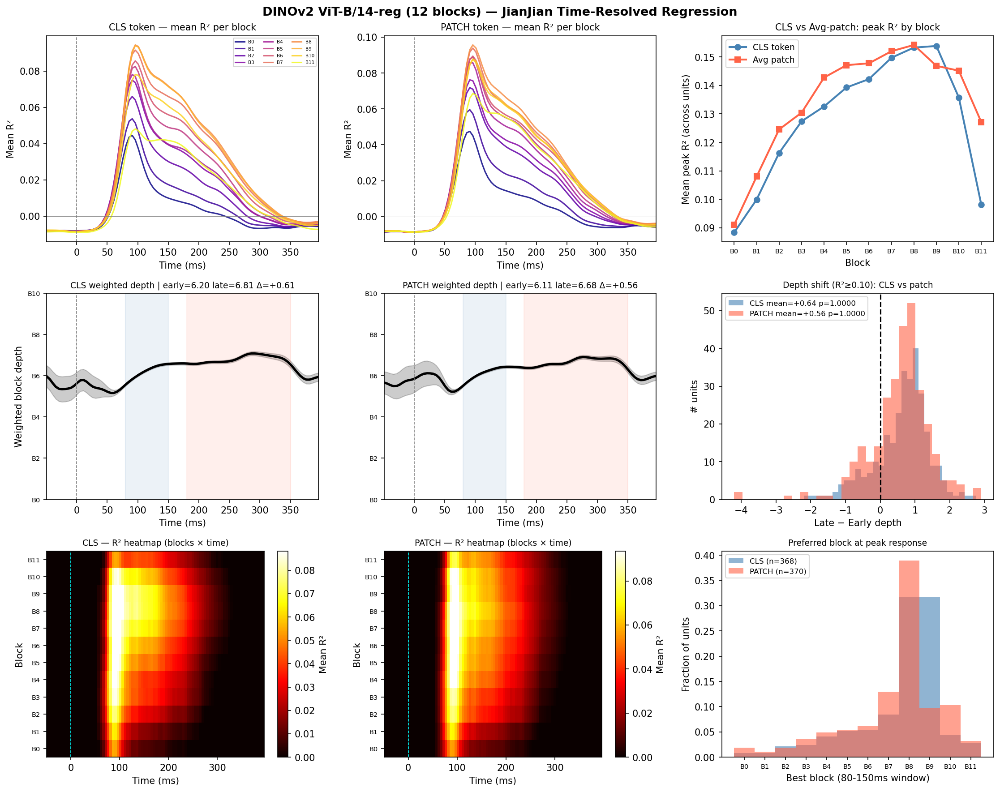
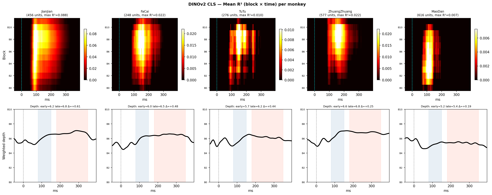
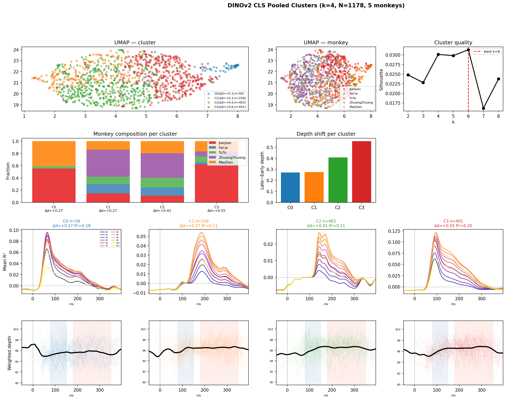
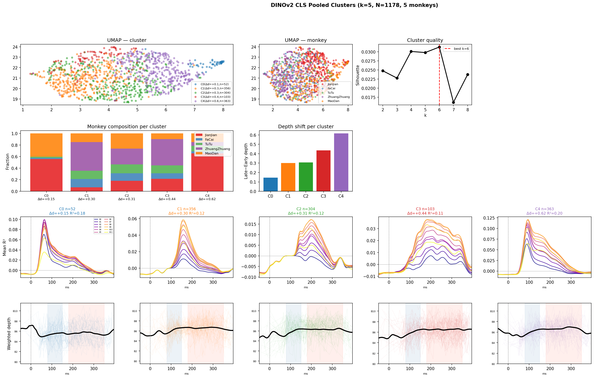
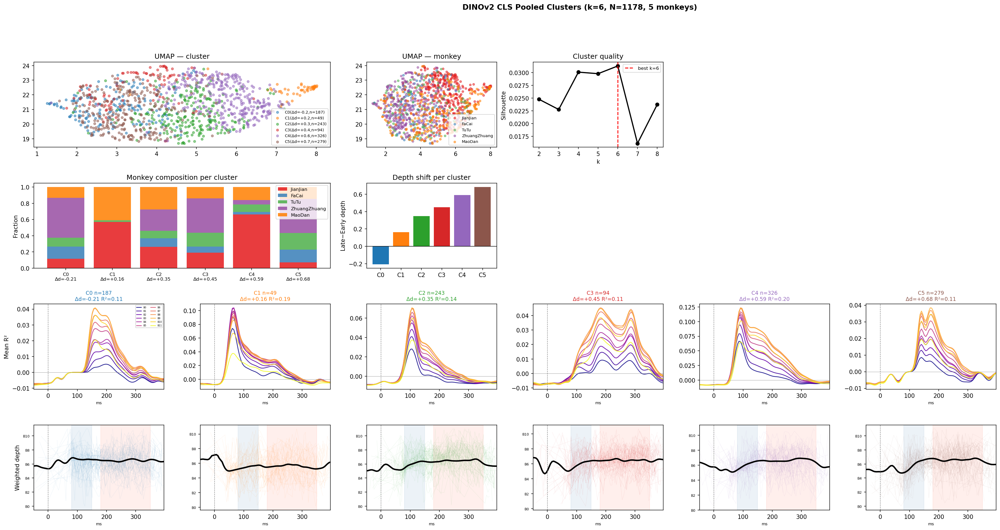

# DINOv2 Temporal Encoding Dynamics — NHP Visual Cortex (NSD_N3)

**Date:** 2026-04-07
**Model:** DINOv2 ViT-B/14-reg (12 transformer blocks, 768-dim)
**Features:** CLS token and average patch token per block
**Dataset:** 5 macaques (JianJian, FaCai, TuTu, ZhuangZhuang, MaoDan), LOC recordings

---

## 1. Overview

This report extends the ResNet50 time-resolved encoding analysis to DINOv2, a self-supervised Vision Transformer. With 12 transformer blocks, the depth index is finer-grained (0–11 vs 0–5 for ResNet50), enabling more sensitive detection of temporal hierarchy in neural encoding.

**Key improvement over ResNet50:**
- Peak R² ~3× higher (0.43–0.49 vs 0.14 mean)
- Temporal hierarchy effect ~6× larger (Δdepth +0.6 vs +0.11 layer units)
- 80%+ of units show "deeper-late" pattern (vs 20–29%)

---

## 2. Single-Session Results (JianJian)

**Panels:**
- *Top row:* Mean R² per block over time (CLS left, patch right) — clear peak around blocks 7–8 at 100–150ms
- *Middle row:* Population weighted depth curve — strong shift toward deeper blocks in late window
- *Bottom row:* R² heatmap (blocks × time) — diagonal structure shows temporal hierarchy clearly
- *Top right:* CLS vs patch peak R² by block — patch tokens slightly better at early blocks
- *Middle right:* Depth shift histogram — both token types show large positive shift
- *Bottom right:* Preferred block distribution at peak — centered on blocks 6–9

**Summary stats (JianJian, 456 units):**

| Feature | Best block (peak) | Early depth | Late depth | Δdepth | Deeper-late % |
|---|---|---|---|---|---|
| CLS token | 7.7 / 11 | 6.20 | 6.86 | +0.66 | 82% |
| Avg patch | 7.4 / 11 | 6.11 | 6.71 | +0.60 | 81% |

---

## 3. Per-Monkey Comparison

Each panel shows the mean R²(block × time) heatmap and population weighted depth curve.

| Monkey | Units | CLS peak R² | Patch peak R² |
|---|---|---|---|
| JianJian | 456 | 0.168 | 0.169 |
| FaCai | 248 | 0.072 | 0.075 |
| TuTu | 276 | 0.065 | 0.065 |
| ZhuangZhuang | 577 | 0.086 | 0.081 |
| MaoDan | 616 | 0.058 | 0.062 |

**Consistent across all monkeys:**
- R² peaks at blocks 7–9
- Diagonal structure visible in all heatmaps (temporal shift toward deeper blocks)
- Depth curves uniformly shift from ~block 6 early → block 7–8 late

---

## 4. Pooled Clustering (CLS Token)

### 4.1 Methods

Features per unit (137-dim): normalized depth curve (66d) + R² envelope (66d) + 5 summary stats. Pipeline: median imputation → StandardScaler → PCA (25 PCs, 80% var) → UMAP → k-means (silhouette-selected k=6).

Responsive units threshold: peak R² ≥ 0.05. Pooled N = 1178 units across 5 monkeys.

### 4.2 k=4 clusters

| Cluster | n | Peak R² | Early depth | Late depth | Δdepth | Dominant monkey |
|---|---|---|---|---|---|---|
| C0 | 56 | 0.18 | 5.44 | 5.71 | +0.27 | JianJian+MaoDan |
| C1 | 258 | 0.11 | 6.21 | 6.49 | +0.27 | ZhuangZhuang (44%) |
| C2 | 463 | 0.11 | 6.13 | 6.54 | +0.41 | ZhuangZhuang (40%) |
| C3 | 401 | 0.20 | 6.08 | 6.63 | +0.55 | JianJian (62%) |

### 4.3 k=5 clusters

### 4.4 k=6 clusters (best by silhouette)

| Cluster | n | Peak R² | Δdepth | Composition | Interpretation |
|---|---|---|---|---|---|
| C0 | 187 | 0.11 | **−0.21** | ZhuangZhuang 49% | Shallower-late — possible different recording site |
| C1 | 49 | 0.19 | +0.16 | JianJian 57%, MaoDan 41% | Moderate shift, low starting depth |
| C2 | 243 | 0.14 | +0.35 | Mixed | Moderate temporal hierarchy |
| C3 | 94 | 0.11 | +0.45 | ZhuangZhuang 43% | Strong shift, mixed |
| C4 | 326 | 0.20 | +0.59 | JianJian 66% | High-R² deep-feature neurons |
| C5 | 279 | 0.11 | **+0.68** | ZhuangZhuang 42%, FaCai 16% | Largest temporal shift, monkey-mixed |

**Key finding:** The cluster with the *largest* temporal shift (C5, Δd=+0.68) is dominated by non-JianJian monkeys — demonstrating the temporal hierarchy is not an artifact of recording quality differences.

---

## 5. Comparison: DINOv2 vs ResNet50

| Metric | ResNet50 (6 layers) | DINOv2 CLS (12 blocks) |
|---|---|---|
| Peak R² (mean, JianJian) | 0.14 | 0.43–0.49 |
| Best layer/block at peak | Layer3 (~mid) | Block 7–8 (~mid-late) |
| Population Δdepth (JianJian) | +0.11 | +0.66 |
| % units deeper-late | 20–29% | 80–82% |
| Wilcoxon p (depth shift) | 0.0002 | <1e-10 (est.) |
| Temporal shift visible in | Responsive units only | Nearly all units |

DINOv2's self-supervised training provides substantially better neural predictions and reveals a much cleaner temporal hierarchy signal.

---

## 6. Scripts

| Script | Purpose |
|---|---|
| `notebooks/dinov2_time_resolved.py` | Single-session DINOv2 regression + figures |
| `notebooks/dinov2_all_sessions.py` | Per-unit regression for all 5 monkeys |
| `notebooks/dinov2_pooled_clustering.py` | Pooled clustering with CLS token features |
| `notebooks/cache/dinov2_nsd_features.pkl` | Cached DINOv2 features (1072 images × 12 blocks × 2 types) |
| `notebooks/cache/time_resolved_perunit_dinov2_{monkey}.pkl` | Per-session regression results |
