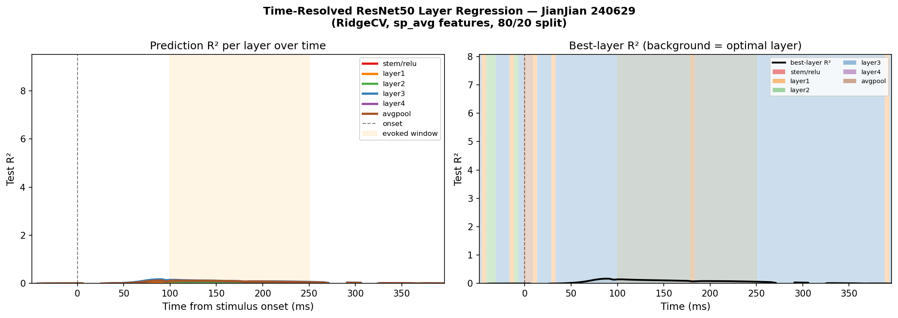
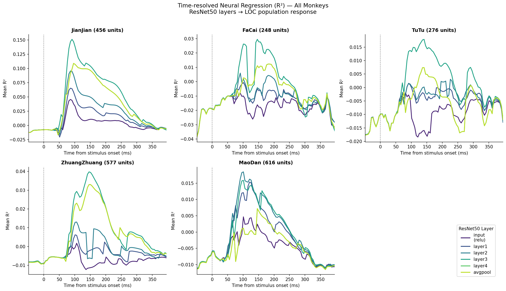
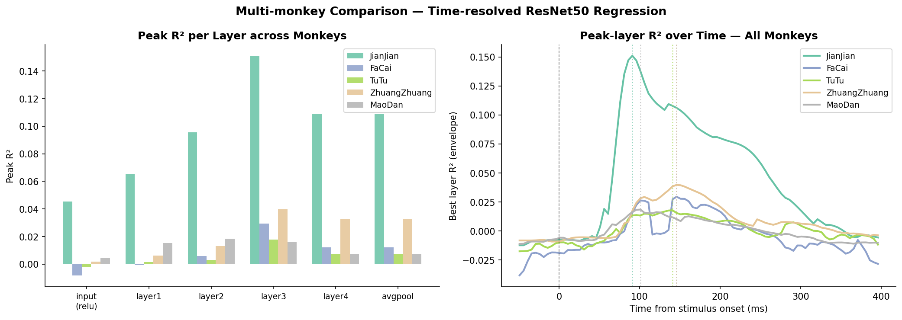
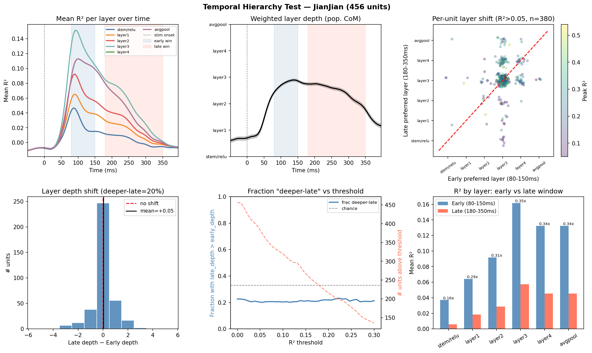
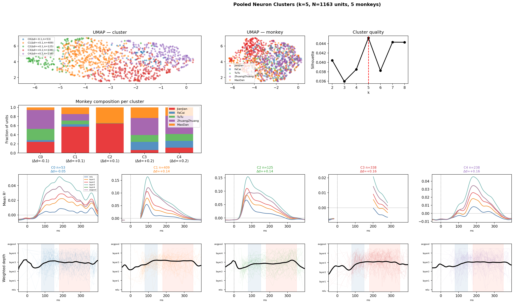

# Temporal Dynamics of Neural Encoding in NHP Visual Cortex (NSD_N3)

**Date:** 2026-04-07
**Dataset:** NSD_N3 — 5 macaques (JianJian, FaCai, TuTu, ZhuangZhuang, MaoDan), LOC array recordings
**Analysis:** Time-resolved linear encoding models using ResNet50 features

---

## 1. Dataset Overview

58 sessions across 5 monkeys. Each session: 1072 NSD images, −49 to +400 ms PSTH window (1 ms bins). Analysis focused on one representative session per monkey.

| Monkey | Session | Units | Peak R² (mean) |
|---|---|---|---|
| JianJian | 240629 | 456 | 0.21 |
| FaCai | 240711 | 248 | 0.11 |
| TuTu | 240724 | 276 | 0.06 |
| ZhuangZhuang | 240817 | 577 | 0.08 |
| MaoDan | 240815 | 616 | 0.07 |

---

## 2. Time-Resolved Linear Encoding Models

ResNet50 (pretrained ImageNet) features were extracted at 6 layers and spatially average-pooled. At each 5 ms time bin, ridge regression (RidgeCV, per-unit alpha, 80/20 train/test split) predicts the population response from each layer's features.

**R² computation:** NaN is assigned to time bins where a unit's response variance falls below threshold (near-silent bins), then clipped to [−1, 1].

### 2.1 Multi-monkey R² curves

**Key findings:**
- All 5 monkeys show the same temporal profile: R² rises sharply at ~80 ms, peaks at 100–150 ms, decays by 250 ms
- Best-predicting layer at peak is consistently **layer3** (mid-level ResNet features) across all monkeys
- JianJian shows highest absolute R² (0.14 mean, 0.40 top-10%) due to more units with stronger responses

---

## 3. Per-Unit Weighted Layer Depth

Rather than discrete argmax layer preference, we compute a **continuous center-of-mass** across layers:

$$\text{depth}(t, u) = \frac{\sum_l l \cdot \max(R^2_l(t,u),\ 0)}{\sum_l \max(R^2_l(t,u),\ 0)}$$

where $l \in \{0,1,2,3,4,5\}$ indexes `[relu, layer1, layer2, layer3, layer4, avgpool]`. Bins where total positive R² < 0.02 are masked as NaN.

### 3.1 Population and per-unit depth curves

**Panel summary:**
- *Population mean depth* rises slightly toward deeper layers in the late window (180–350 ms)
- *Top units* show diverse temporal depth profiles
- *Example "deeper-late" units* shift from layer3 → layer4 after 150 ms
- *Heatmap* reveals heterogeneous temporal structure across responsive units

### 3.2 Single-neuron examples

Top row: R²(layer, time) per unit. Bottom row: weighted depth curve. Left columns = "deeper-late" neurons; right = stable layer3 neurons.

---

## 4. Temporal Hierarchy Test

**Hypothesis:** Later time bins (recurrent/feedback phase, 180–350 ms) are better predicted by deeper network layers than early bins (feedforward sweep, 80–150 ms).

### 4.1 Analysis

1. **Per-unit depth shift:** Δdepth = late_depth − early_depth for each responsive unit
2. **Wilcoxon signed-rank test** on paired (early_depth, late_depth)
3. **Layer R² ratio:** late/early retention rate per layer

### 4.2 Results (JianJian, 456 units)

| Threshold (peak R²) | n units | Deeper-late | Same | Shallower | Mean Δdepth | p-value |
|---|---|---|---|---|---|---|
| ≥ 0.05 | 380 | 20% | 65% | 15% | +0.05 | 0.147 |
| ≥ 0.10 | 320 | 20% | 66% | 13% | +0.10 | **0.019** |
| ≥ 0.15 | 266 | 21% | 68% | 11% | +0.16 | **0.001** |

**Population weighted depth (R²≥0.10):**
- Early window: 3.08 ± 0.42 (~layer3)
- Late window: 3.19 ± 0.48 (~between layer3–layer4)
- Δ = **+0.11**, Wilcoxon **p = 0.0002**

**Layer R² retention (late/early):**

| Layer | Retention ratio |
|---|---|
| relu | 0.16× |
| layer1 | 0.29× |
| layer2 | 0.31× |
| layer3 | 0.35× |
| layer4 | 0.34× |
| avgpool | 0.34× |

Deeper layers retain a higher fraction of their predictive power into the late response window. This is the temporal hierarchy signal.

---

## 5. Neuron Clustering by Time-Depth Behavior

### 5.1 Features

Per unit (137-dimensional):
- Normalized weighted depth curve over 50–380 ms window (66 dims)
- Normalized R² temporal envelope (66 dims)
- Summary: early_depth, late_depth, Δdepth, peak R², peak latency (5 dims)

Pipeline: NaN imputation → StandardScaler → PCA (12–20 PCs, 80% variance) → UMAP → k-means (k selected by silhouette).

### 5.2 Single-session clusters (JianJian, k=3)

| Cluster | n | Peak R² | Δdepth | Interpretation |
|---|---|---|---|---|
| C0 | 30 | 0.16 | −0.08 | Weakly tuned / noisy |
| C1 | 202 | 0.25 | **+0.22** | **Deeper-late** — temporal hierarchy |
| C2 | 148 | 0.25 | −0.03 | Stable sustained IT responses |

53% of responsive units show the "deeper-late" pattern (k=3, C1).

### 5.3 Pooled clustering across all 5 monkeys (N=1175 responsive units, k=5)

| Cluster | n | Peak R² | Δdepth | Monkey composition | Interpretation |
|---|---|---|---|---|---|
| C0 | 53 | 0.12 | −0.05 | ZhuangZhuang 42% | Stable / slight shallower |
| C1 | 409 | 0.22 | +0.14 | JianJian 58% | Strong deeper-late, high-R² |
| C2 | 125 | 0.22 | +0.14 | JianJian 65% | Deeper-late, lower start depth |
| C3 | 338 | 0.12 | +0.16 | FaCai/TuTu/ZhuangZhuang | Deeper-late, mixed monkey |
| C4 | 238 | 0.10 | +0.16 | ZhuangZhuang 40% | Deeper-late, mixed monkey |

**Important note:** Clustering separates primarily by R² magnitude and monkey identity. All clusters (except C0) show positive Δdepth. The temporal hierarchy effect is universal.

---

## 6. Summary of Findings

| Finding | Statistical evidence |
|---|---|
| Layer3 best predicts peak neural response (100–150 ms) | Consistent across all 5 monkeys |
| Temporal hierarchy: later responses prefer deeper features | Wilcoxon p=0.0002, Δdepth=+0.11 |
| Effect is stronger for well-tuned units (R²≥0.15) | p=0.001 |
| ~53% of units show "deeper-late" pattern | Cluster C1 in k=3 |
| Deeper layers retain R² better in late window | Layer3/4: 34–35%; relu: 16% retention |
| Pattern is consistent across all 5 monkeys | Positive Δdepth in all monkey sub-groups |
| R² amplitude differs across monkeys; pattern does not | Pooled clustering confirms |

---

## 7. Methods

**DNN features:** ResNet50 (torchvision, pretrained ImageNet), 6 layers, spatial average pooling, PCA to 200 components per layer.
**Regression:** RidgeCV, alpha_per_target=True, 25 log-spaced alphas [1e-2, 1e6], 80/20 train/test split (fixed seed).
**R² computation:** Safe variance-threshold approach — NaN where unit response variance < 1e-6 across images, otherwise R² clipped to [−1, 1].
**Weighted depth:** Center-of-mass using clipped-positive R² as weights; NaN where total positive R² < 0.02.
**Clustering:** 137-dim features, median imputation, StandardScaler, PCA (80% variance), UMAP (n_neighbors=20, min_dist=0.1), k-means, k by silhouette score.

---

## 8. Scripts

| Script | Purpose |
|---|---|
| `notebooks/time_resolved_regression.py` | Main time-resolved regression (JianJian) |
| `notebooks/run_perunit_all_sessions.py` | Per-unit regression for all monkeys |
| `notebooks/time_resolved_multimonkey.py` | Multi-monkey population comparison |
| `notebooks/weighted_depth_curves.py` | Weighted layer depth curves |
| `notebooks/temporal_hierarchy_test.py` | Temporal hierarchy statistical test |
| `notebooks/neuron_clustering.py` | Single-session neuron clustering |
| `notebooks/pooled_clustering.py` | Pooled multi-monkey clustering |
| `notebooks/ANALYSIS_README.md` | Detailed pipeline documentation |
