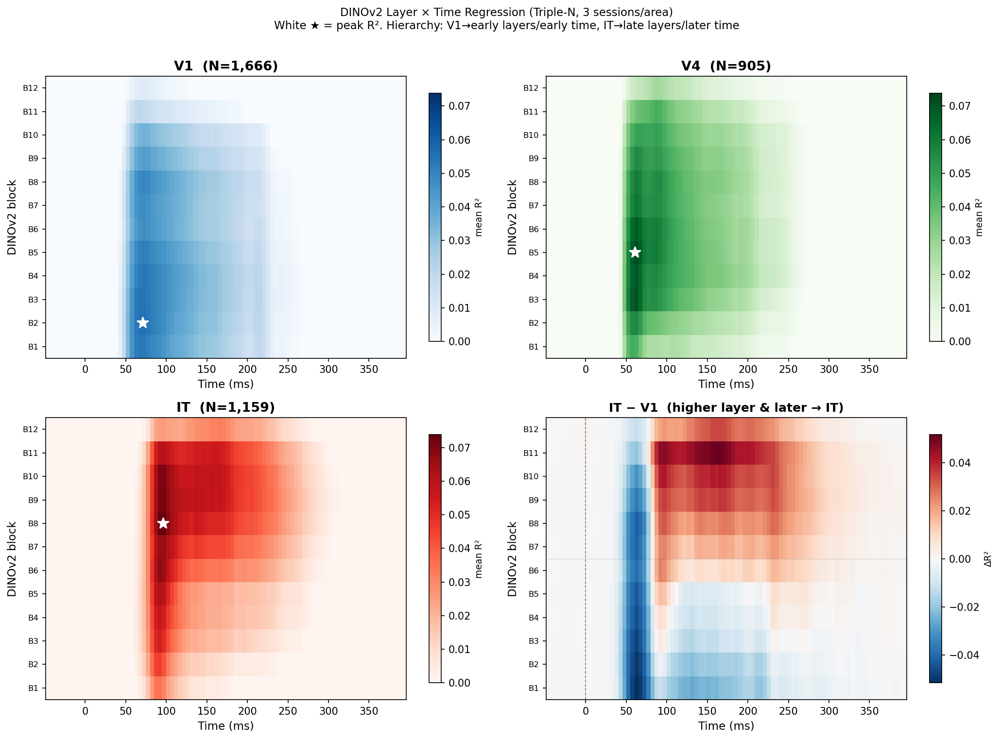
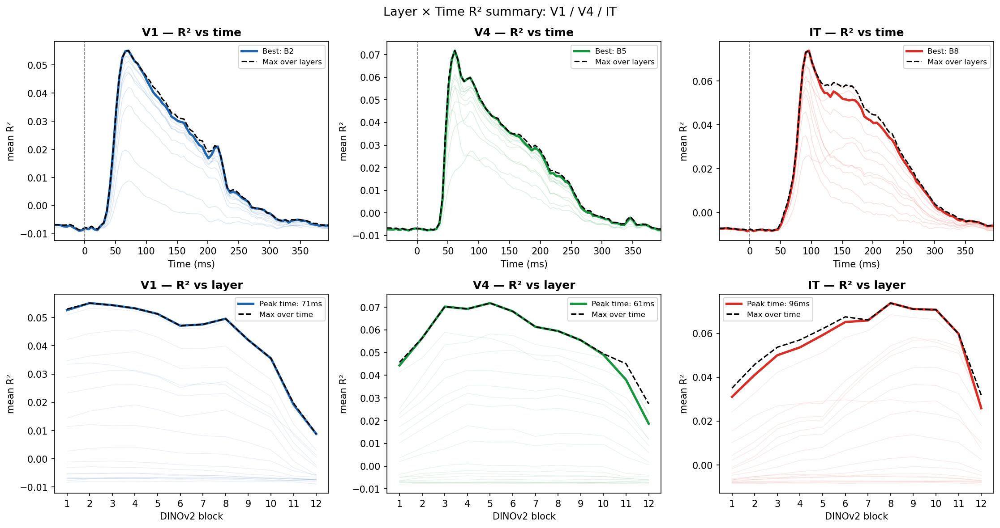

# Triple-N: DINOv2 Layer × Time Regression Across V1, V4, and IT

**Dataset:** Triple-N (90 sessions, 5 macaques, Neuropixels NHP)
**Analysis date:** 2026-05-12
**Script:** `notebooks/tripleN_layer_time_regression.py`

---

## Overview

A central question in visual neuroscience is how the cortical hierarchy maps onto the computational hierarchy of deep neural networks — and how this unfolds dynamically in time. Here we asked: *at each moment in time, which layer of DINOv2 best predicts the activity of neurons in V1, V4, and IT?*

We used **time-resolved ridge regression** to regress per-unit spike responses (from full PSTH traces) against DINOv2 ViT-B/14-reg CLS features extracted from each of 12 transformer blocks. This yields a 2D map of predictability: $R^2(\ell, t)$ — how well layer $\ell$ at time $t$ explains neural activity — averaged over neurons in each area.

---

## Data

| Area | Sessions | Units (reliable) |
|------|----------|-----------------|
| V1   | 3 (ses72, 75, 77) | **1,666** |
| V4   | 3 (ses79, 80, 83) | **905**   |
| IT   | 3 (ses1, 2, 3)    | **1,159** |

Units were selected with split-half reliability $\geq 0.2$. Session-to-area assignment uses electrode depth mapped against the `exclude_area.xls` atlas (see `core/tripleN.py`).

---

## Methods

### Feature extraction

DINOv2 ViT-B/14-reg features were extracted from all 1072 NSD images. For each of the 12 transformer blocks $\ell \in \{1, \ldots, 12\}$, we used the CLS token output:

$$\mathbf{f}_\ell(i) \in \mathbb{R}^{768}, \quad i = 1, \ldots, 1072$$

Features were compressed to 100 PCA dimensions fit on the training split.

### Time-resolved regression

For each area, each session, each DINOv2 layer $\ell$, and each time bin $t$:

$$\hat{y}_u(i) = \mathbf{w}_{\ell,t,u}^\top \mathbf{f}_\ell(i) + b$$

fitted via RidgeCV ($\alpha \in [10^{-2}, 10^6]$, 20 log-spaced values, per-target $\alpha$) on an 80% train split. Test $R^2$ was computed per unit:

$$R^2_{\ell,t,u} = 1 - \frac{\sum_i (y_u(i) - \hat{y}_u(i))^2}{\sum_i (y_u(i) - \bar{y}_u)^2}$$

with NaN assigned to near-constant units ($SS_\text{tot} < 10^{-6}$). The area-level summary is:

$$\overline{R^2}_{\ell,t}^{(\text{area})} = \frac{1}{N_\text{area}} \sum_{u \in \text{area}} R^2_{\ell,t,u}$$

Time bins were sampled every 5 ms (stride=5) over $t \in [-49, 400]$ ms, giving 90 time points.

---

## Results

### Layer × time heatmaps

*Three heatmaps (V1, V4, IT) show mean $R^2$ as a function of DINOv2 block (y-axis, B1=earliest, B12=latest) and post-stimulus time (x-axis). White star = peak R². Bottom-right: IT−V1 difference — red = IT-dominant (late layer, late time), blue = V1-dominant (early layer, early time).*

### Summary curves

*Top row: R² vs time for each layer (faint) + best layer (bold) + envelope (dashed). Bottom row: R² vs layer for each time (faint) + peak-time slice (bold) + envelope (dashed).*

---

## Key findings

### 1. Cortical hierarchy maps onto DINOv2 depth

| Area | Peak layer | Mean R² at peak | Best avg layer |
|------|-----------|----------------|----------------|
| V1   | **B2**    | 0.055          | B3             |
| V4   | **B5**    | 0.072          | B4             |
| IT   | **B8–9**  | 0.074          | B9             |

V1 is best explained by the earliest blocks of DINOv2 (low-level spatial features), V4 by mid-level blocks, and IT by late blocks (high-level semantic features). This recapitulates the known anatomical hierarchy of macaque ventral visual cortex.

### 2. Response latency increases along the hierarchy

| Area | Approx. response onset (R² > 50% max) | Peak time |
|------|----------------------------------------|-----------|
| V1   | ~51 ms                                | **71 ms** |
| V4   | ~51 ms                                | **61 ms** |
| IT   | ~81 ms                                | **96 ms** |

IT responses peak ~25 ms later than V1/V4, consistent with the well-established latency hierarchy in macaque ventral stream (V1 ≈ 40–70 ms, V4 ≈ 50–80 ms, IT ≈ 80–120 ms).

### 3. The two hierarchies are separable

The IT−V1 difference panel reveals two spatially distinct blobs:
- **Red (top-right):** IT uniquely driven by late DINOv2 layers at late times (~80–200 ms) — semantic processing
- **Blue (bottom-left):** V1 uniquely driven by early DINOv2 layers at early times (~40–80 ms) — edge/texture processing

This means layer preference and temporal preference are *both* systematic signatures of cortical area identity.

### 4. V4 occupies an intermediate position

V4 shows a peak at layer B5 — squarely between V1 (B2) and IT (B8), matching its intermediate position in the ventral hierarchy. Its onset timing (~51 ms) is similar to V1, but its peak time (~61 ms) is also intermediate.

---

## Interpretation

These results establish a two-axis fingerprint for cortical areas in the primate visual hierarchy:

$$\text{Area identity} \approx (\ell^*, t^*) = \underset{\ell,t}{\arg\max} \; R^2_{\ell,t}^{(\text{area})}$$

The DINOv2 layer axis captures the **spatial/feature complexity** gradient (V1→IT maps to edges→objects), while the time axis captures the **processing latency** gradient driven by conduction delays and recurrent dynamics.

The fact that DINOv2 — trained purely on self-supervised image prediction — recovers this hierarchy spontaneously suggests that the representational geometry of macaque ventral cortex is strongly shaped by the statistical structure of natural images.

---

## Files

| File | Description |
|------|-------------|
| `notebooks/tripleN_layer_time_regression.py` | Full analysis script |
| `figures/tripleN_layer_time/fig_layer_time_main.png` | Main 2×2 heatmap figure |
| `figures/tripleN_layer_time/fig_layer_time_summary.png` | Summary curves (R² vs time, R² vs layer) |
| `figures/tripleN_layer_time/fig_layer_time_heatmap_unified.png` | All 3 areas on unified color scale |
| `core/tripleN.py` | Triple-N data loader |
| `core/regression.py` | Regression utilities |
| `core/features.py` | DINOv2 feature extraction |

---

## Related reports

- [`REPORT_dinov2_temporal_encoding.md`](REPORT_dinov2_temporal_encoding.md) — NSD_N3 time-resolved regression per monkey
- [`REPORT_temporal_encoding_dynamics.md`](REPORT_temporal_encoding_dynamics.md) — Cluster analysis of temporal R² profiles
- [`REPORT_weight_dynamics.md`](REPORT_weight_dynamics.md) — Regression weight vector dynamics (cosine similarity, LDS model)
