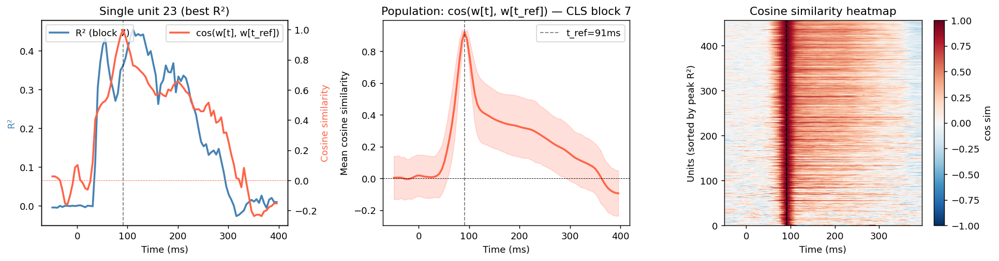
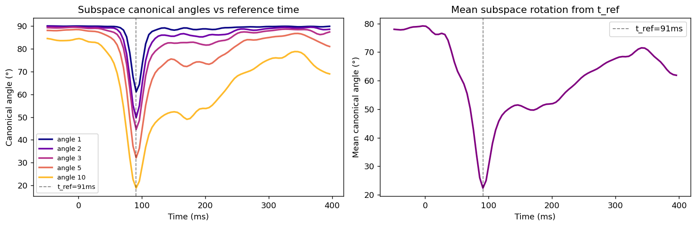
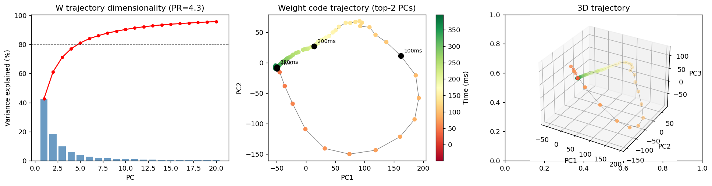
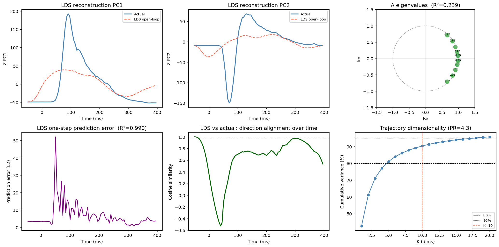

# Regression Weight Dynamics — Temporal Evolution of Neural Coding Axes

**Date:** 2026-04-08
**Model:** DINOv2 ViT-B/14-reg, CLS token, Block 7 (best predictive layer)
**Subject:** JianJian (456 units, LOC array)

---

## 1. Motivation

The time-resolved regression analysis showed *that* the preferred network depth shifts over time (temporal hierarchy). This report asks a deeper question: **how does the neural coding direction itself change?** For each unit, we fit a linear readout from DINOv2 features at every time bin — the resulting weight vector defines the unit's "feature preference axis" in PC space. Tracking these axes over time reveals the geometry of the temporal code.

---

## 2. Methods

### 2.1 Notation

Let:
- $\mathbf{F} \in \mathbb{R}^{N \times D}$ — DINOv2 block-7 CLS features for $N=1072$ images, PCA-reduced to $D=200$
- $\mathbf{Y}(t) \in \mathbb{R}^{N \times U}$ — neural response matrix at time bin $t$, $U=456$ units
- $\hat{\mathbf{W}}(t) \in \mathbb{R}^{U \times D}$ — regression weight matrix at time $t$

### 2.2 Time-resolved regression

At each time bin $t$, we fit a multi-output Ridge regression:

$$\hat{\mathbf{W}}(t) = \arg\min_{\mathbf{W}} \left\| \mathbf{F}_\text{train} \mathbf{W}^\top - \mathbf{Y}_\text{train}(t) \right\|_F^2 + \lambda \|\mathbf{W}\|_F^2$$

with $\lambda$ selected per-unit via 5-fold cross-validation (`RidgeCV`, $\lambda \in [10^{-2}, 10^6]$).

Row $u$ of $\hat{\mathbf{W}}(t)$, denoted $\mathbf{w}_u(t) \in \mathbb{R}^D$, is the **coding direction** of unit $u$ at time $t$ — the direction in feature space that best predicts its firing rate.

### 2.3 Per-unit cosine similarity

To measure how much each unit's coding direction rotates over time, we compute:

$$\rho_u(t) = \frac{\mathbf{w}_u(t) \cdot \mathbf{w}_u(t^*)}{\|\mathbf{w}_u(t)\| \, \|\mathbf{w}_u(t^*)\|}$$

where $t^* = \arg\max_t \overline{R^2}(t)$ is the reference time at peak population response (~91 ms).

### 2.4 Population subspace canonical angles

The population weight matrix $\hat{\mathbf{W}}(t)$ defines a subspace in $\mathbb{R}^U$ (the span of its rows). We extract the top-$k$ left singular vectors:

$$\hat{\mathbf{W}}(t) = \mathbf{U}(t) \boldsymbol{\Sigma}(t) \mathbf{V}(t)^\top, \quad \mathbf{Q}(t) = \mathbf{U}(t)_{:,1:k}$$

The **canonical angles** $\theta_1(t) \leq \cdots \leq \theta_k(t)$ between subspaces $\mathbf{Q}(t)$ and $\mathbf{Q}(t^*)$ are the arc-cosines of the singular values of $\mathbf{Q}(t^*)^\top \mathbf{Q}(t)$.

### 2.5 Trajectory dimensionality

We flatten and stack weights across time:

$$\mathbf{Z} = \begin{bmatrix} \text{vec}(\hat{\mathbf{W}}(t_1))^\top \\ \vdots \\ \text{vec}(\hat{\mathbf{W}}(t_T))^\top \end{bmatrix} \in \mathbb{R}^{T \times UD}$$

After mean-centering across time, SVD of $\mathbf{Z}$ gives singular values $\sigma_1 \geq \cdots \geq \sigma_T$. The **participation ratio**:

$$\text{PR} = \frac{\left(\sum_i \sigma_i^2\right)^2}{\sum_i \sigma_i^4}$$

measures the effective dimensionality of the temporal trajectory. $\text{PR} = 1$ means a single mode dominates; $\text{PR} = T$ means all time bins are independent.

For a more compact representation, we define the low-dimensional trajectory:

$$\mathbf{z}(t) = \boldsymbol{\Sigma}_{:K} \mathbf{U}_{:K}^\top \big|_t \in \mathbb{R}^K$$

where $K$ is chosen to capture 80–95% of variance.

### 2.6 Linear State Space (LDS) model

We test whether the low-dimensional code trajectory is consistent with an autonomous linear dynamical system:

$$\mathbf{z}(t+1) = \mathbf{A}\,\mathbf{z}(t) + \boldsymbol{\epsilon}(t)$$

The transition matrix $\mathbf{A} \in \mathbb{R}^{K \times K}$ is estimated by least squares:

$$\hat{\mathbf{A}} = \mathbf{Z}_{t+1} \mathbf{Z}_t^\top \left(\mathbf{Z}_t \mathbf{Z}_t^\top\right)^{-1}$$

where $\mathbf{Z}_t = [\mathbf{z}(t_1), \ldots, \mathbf{z}(t_{T-1})]$.

**Open-loop prediction:** roll out $\hat{\mathbf{z}}(t+1) = \hat{\mathbf{A}}\,\hat{\mathbf{z}}(t)$ from $t=0$, measuring $R^2$ against the true trajectory.

**One-step prediction:** evaluate $\hat{\mathbf{A}}\,\mathbf{z}(t)$ at each step independently, measuring local linearity.

The eigenvalues $\{\lambda_i\}$ of $\hat{\mathbf{A}}$ characterize the dynamics:
- $|\lambda_i| = 1$: sustained oscillation
- $|\lambda_i| < 1$: damped / decaying mode
- Complex eigenvalues: rotational dynamics at frequency $f = \angle\lambda_i / (2\pi \Delta t)$

---

## 3. Results

### 3.1 Per-unit cosine similarity over time

**Key finding:** Individual units' coding directions are *not* stable across time.

| Time | Mean cosine similarity to $t^* = 91$ ms |
|---|---|
| 50 ms | 0.095 |
| 91 ms (ref) | 1.000 |
| 250 ms | 0.253 |

The low cosine values (~0.1–0.25) indicate that the feature direction a neuron prefers at early vs. late times is largely orthogonal — **units do not simply scale up/down a fixed coding direction; they rotate to prefer different feature combinations.**

The heatmap (right panel) shows this is consistent across units: all responsive neurons show near-zero cosine before onset and after ~200ms, with a sharp peak at ~91ms.

---

### 3.2 Population subspace canonical angles

The top-20 canonical angles between the population subspace at each time and the reference subspace hover at **~60–65°** across most of the response window. Even at the plateau (~100–250ms), the code is ~60° away from peak — the subspace rotates dramatically from pre-stimulus baseline through the response.

**Interpretation:** The population is not simply amplifying a fixed subspace. The entire geometry of the neural code (which combinations of features are jointly encoded) shifts continuously.

---

### 3.3 Weight trajectory dimensionality

**Participation ratio = 4.3** — out of 90 possible time bins, the entire temporal evolution of the population code lives in a ~4-dimensional manifold.

| Variance threshold | PCs needed |
|---|---|
| 50% | 2 |
| 80% | 5 |
| 95% | 18 |

The 2D trajectory (center panel) shows a characteristic arc: starting near the origin (pre-stimulus), swinging out rapidly at ~100ms, then returning along a slightly different path — a *horseshoe* or *loop* structure in code space. This is the geometric signature of transient stimulus-driven dynamics that do not simply reverse on the way back.

---

### 3.4 Linear State Space model

| Metric | Value |
|---|---|
| One-step prediction $R^2$ | **0.990** |
| Open-loop $R^2$ | 0.239 |
| Eigenvalue magnitudes | 0.971–0.992 |
| Effective dims ($K$) | 10 (covers ~90% var) |

**One-step $R^2 = 0.99$** — the transition from $\mathbf{z}(t)$ to $\mathbf{z}(t+1)$ is almost perfectly predicted by a single linear map. The dynamics are *locally* linear.

**Open-loop $R^2 = 0.24$** — rolling out the LDS autonomously from $t=0$ accumulates errors rapidly. This means the system is not a *globally* linear autonomous dynamical system — there is a time-varying input (the visual stimulus processing) that drives the trajectory, rather than purely internal recurrent dynamics.

**Eigenvalue spectrum:** All eigenvalues lie inside the unit circle (magnitudes 0.97–0.99), close to but not on it. This rules out a purely oscillatory system and points to a **slowly decaying rotational flow** — the code spirals inward rather than cycling indefinitely.

**Interpretation:** The visual cortex response is consistent with a **driven, locally linear dynamical system** where:
$$\mathbf{z}(t+1) = \mathbf{A}\,\mathbf{z}(t) + \mathbf{B}\,\mathbf{u}(t)$$
where $\mathbf{u}(t)$ is the time-varying "input drive" (feedforward + feedback signals) and $\mathbf{A}$ governs the intrinsic decay. The LDS captures the *shape* of the dynamics locally but not the full trajectory because it omits $\mathbf{B}\mathbf{u}(t)$.

---

## 4. Discussion

Three findings emerge:

1. **Coding directions rotate, not just scale.** Units change *which* DINOv2 features they encode, not just how strongly — the cosine similarity from early to late response is near zero. This is incompatible with a simple gain-modulation model.

2. **The temporal code is ultra-low-dimensional (PR ≈ 4).** Despite 456 units × 90 time bins, the population code trajectory lives in ~4 dimensions. This strong constraint suggests a shared latent drive (e.g. a 4-dimensional recurrent circuit state) governs temporal dynamics across the entire population.

3. **Dynamics are locally linear but not globally autonomous.** The near-perfect one-step LDS fit ($R^2 = 0.99$) combined with poor open-loop propagation indicates the system is best described as a **linear system driven by a time-varying stimulus input** — a classic LDS-with-input ($\mathbf{z}' = \mathbf{A}\mathbf{z} + \mathbf{B}\mathbf{u}$). Identifying $\mathbf{B}$ and $\mathbf{u}(t)$ is a natural next step.

---

## 5. Next Steps

- [ ] Fit the full driven LDS: $\mathbf{z}(t+1) = \mathbf{A}\mathbf{z}(t) + \mathbf{B}\mathbf{u}(t)$, where $\mathbf{u}(t)$ = DINOv2 layer-averaged response to image
- [ ] Repeat across all 5 monkeys — is PR ≈ 4 universal?
- [ ] Compare trajectory dimensionality across DINOv2 blocks (does deeper = higher PR?)
- [ ] Compare CLS vs patch token trajectories

---

## 6. Scripts

| Script | Purpose |
|---|---|
| `notebooks/dinov2_all_sessions.py` | Per-unit R² regression, cached |
| `notebooks/weight_dynamics_analysis.py` | Weight extraction + cosine/subspace/LDS (this report) |
| `notebooks/cache/weight_coefs/JianJian_cls_block7_coefs.npy` | Saved weight tensors $(T \times U \times D)$ |
