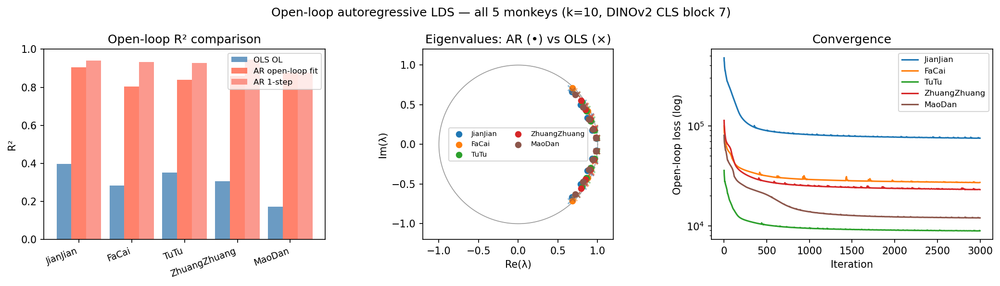
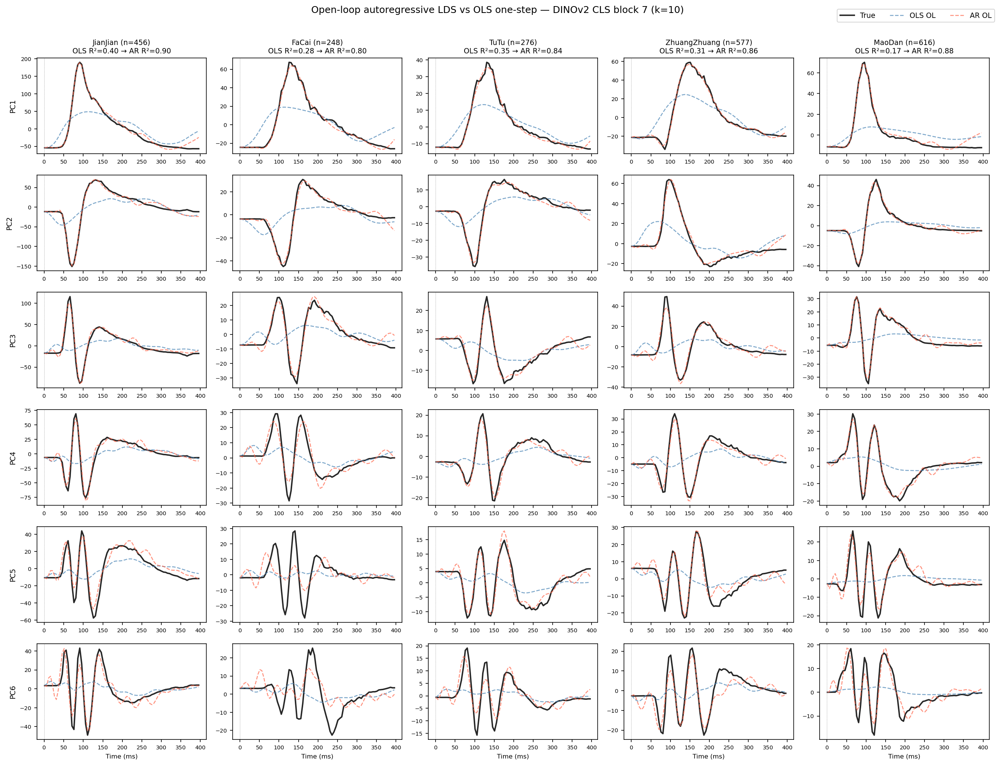
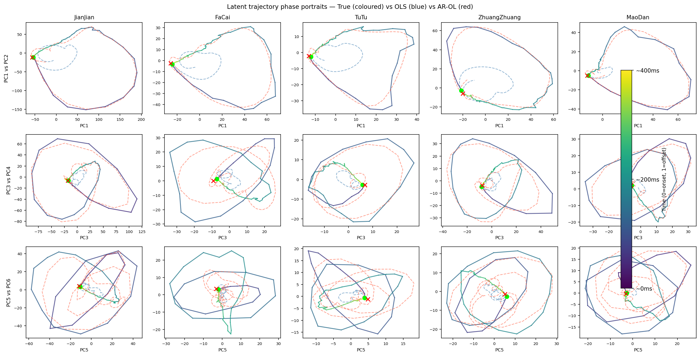
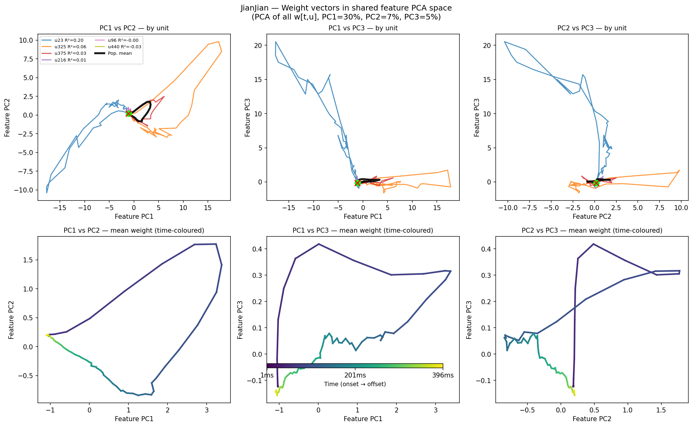
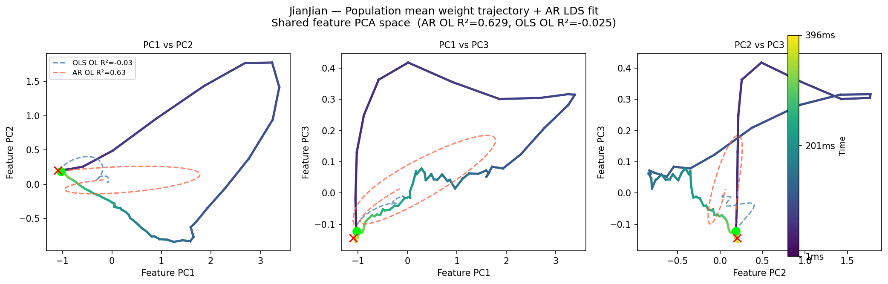
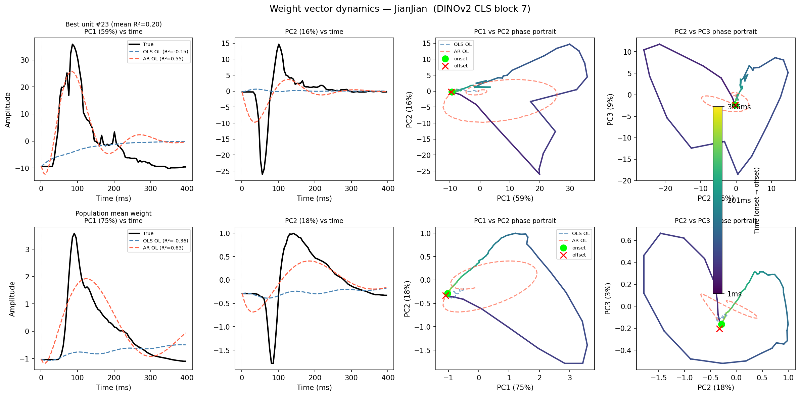

# Weight Dynamics Linear Dynamical System (LDS)

**DINOv2 CLS block 7 × NSD_N3 macaques — regression axis dynamics**

---

## 1. Background and Motivation

Time-resolved ridge regression on DINOv2 features fits a weight vector $\mathbf{w}_{t,u} \in \mathbb{R}^{n_\text{pca}}$ for each unit $u$ and time bin $t$, capturing how the unit's preferred feature direction changes across the visual response.  The full weight tensor

$$W \in \mathbb{R}^{n_t \times n_\text{units} \times n_\text{pca}}$$

is a rich description of population-level temporal dynamics, but is high-dimensional.  We ask: *what low-dimensional linear system can describe how the population coding direction evolves over time?*

---

## 2. Model Variables and Dimensions

### 2.1 Raw weight tensor

| Symbol | Shape | Description |
|--------|-------|-------------|
| $W$ | $(n_t, n_\text{units}, n_\text{pca})$ | Ridge regression weight tensor |
| $n_t$ | 80 | Time bins, $t = 1 \ldots 396$ ms, stride 5 ms (stimulus-driven window only) |
| $n_\text{units}$ | 248–616 | Single units per monkey |
| $n_\text{pca}$ | 200 | PCA components of DINOv2 CLS block 7 features (98% image variance) |

Flattened: $W_\text{flat} \in \mathbb{R}^{n_t \times (n_\text{units} \cdot n_\text{pca})}$, e.g. $80 \times 91{,}200$ for JianJian (456 units).

### 2.2 Latent trajectory (population SVD)

Top-$k$ SVD of the mean-subtracted $W_\text{flat}$:

$$W_\text{flat} = U \Sigma V^\top, \quad U \in \mathbb{R}^{n_t \times n_t},\ \Sigma \in \mathbb{R}^{n_t \times n_t},\ V^\top \in \mathbb{R}^{n_t \times (n_\text{units} \cdot n_\text{pca})}$$

| Symbol | Shape | Description |
|--------|-------|-------------|
| $Z = (U_{:k} \Sigma_{:k})^\top$ | $(k, n_t)$ | Latent trajectory — state at each time bin |
| $C_\text{enc} = V_{:k}$ | $(k,\ n_\text{units} \cdot n_\text{pca})$ | Encoder: maps weight matrix to latent state |
| $C_\text{dec} = V_{:k}^\top$ | $(n_\text{units} \cdot n_\text{pca},\ k)$ | Decoder: reconstructs weight matrix from state |
| $k$ | 10 | Latent state dimension (90% variance for JianJian) |

**Variance explained** (JianJian, $k=10$): PC1 41.3%, PC2 19.0%, PC3 10.0%, cumulative 90.1%.

### 2.3 LDS state-space model

$$\boxed{z_{t+1} = A \, z_t, \quad z_t \in \mathbb{R}^k,\ A \in \mathbb{R}^{k \times k}}$$

| Symbol | Shape | Parameters | Description |
|--------|-------|-----------|-------------|
| $z_t$ | $(k,)$ | — | Latent state at time $t$ |
| $A$ | $(k, k)$ | $k^2 = 100$ | Transition matrix |
| $C_\text{enc}$ | $(k, n_\text{units} \cdot n_\text{pca})$ | $\sim 912{,}000$ | Encoder (fixed by SVD) |
| $C_\text{dec}$ | $(n_\text{units} \cdot n_\text{pca}, k)$ | same | Decoder (= $C_\text{enc}^\top$) |

**Full generative pipeline:**

$$z_0 \xrightarrow{\;A^t\;} z_t \xrightarrow{\;C_\text{dec}\;} \widetilde{W}_t \in \mathbb{R}^{n_\text{units} \times n_\text{pca}} \xrightarrow{\;\mathbf{x}_\text{pca}\;} \hat{r}_t \in \mathbb{R}^{n_\text{units}}$$

Starting from initial state $z_0$ (10 numbers), the dynamics matrix $A$ (100 numbers) generates the full weight trajectory — a **72,960× compression** of the $7.3\mathrm{M}$ raw parameters (treating the encoder as infrastructure).

### 2.4 Shared feature-space PCA (per-unit visualisation)

For visualising individual unit trajectories on a common axis:

$$W_\text{all} \in \mathbb{R}^{(n_t \cdot n_\text{units}) \times n_\text{pca}}$$

Top-3 PCs of $W_\text{all}$ define a shared 200-dim feature subspace.  Each unit's weight vector $\mathbf{w}_{t,u}$ projected onto these 3 directions gives a comparable trajectory across units.

---

## 3. Fitting Methods

### 3.1 Standard OLS one-step fit (baseline)

$$A_\text{OLS} = \operatorname*{argmin}_{A}\ \sum_{t=0}^{T-1} \|z_{t+1} - A z_t\|^2$$

Closed-form solution via least squares: $A_\text{OLS} = Z_{1:T} (Z_{0:T-1})^+$.

**Limitation:** minimises one-step error only.  When evaluated open-loop (rollout from $z_0$), $A_\text{OLS}$ averages over all temporal phases and becomes too damped — it cannot simultaneously capture the fast onset rise *and* the slow sustained decay.

| Monkey | OLS open-loop $R^2$ |
|--------|------------|
| JianJian | 0.397 |
| FaCai | 0.283 |
| TuTu | 0.352 |
| ZhuangZhuang | 0.306 |
| MaoDan | 0.173 |

### 3.2 Open-loop autoregressive fit (AR-LDS)

**Objective:** directly minimise the open-loop prediction error across the full trajectory:

$$\boxed{A_\text{AR} = \operatorname*{argmin}_{A}\ \sum_{t=1}^{T} \|z_t - A^t z_0\|^2_F + \lambda \|A\|^2_F}$$

where $A^t z_0 = A(A(\cdots(A z_0)\cdots))$ is the $t$-step rollout from the initial state.

**Algorithm:**

1. Extract latent trajectory $Z \in \mathbb{R}^{k \times T}$ via top-$k$ SVD of $W_\text{flat}$.
2. Initialise $A$ from the OLS estimate (warm start for convergence speed).
3. At each gradient step:
   - Roll out $\hat{z}_t = A^t z_0$ sequentially for $t = 1 \ldots T$.
   - Compute $\mathcal{L}(A) = \sum_t \|\hat{z}_t - z_t\|^2 + \lambda \|A\|^2_F$.
   - Back-propagate through the sequential rollout via PyTorch autograd.
   - Update $A$ with Adam ($\eta = 10^{-3}$, $\lambda = 10^{-4}$, 3000 iterations).

**Properties:**
- Converges reliably from OLS initialisation in ~3000 Adam steps.
- All eigenvalues remain inside the unit circle ($\max|\lambda| \approx 0.98$–$0.99$) — stable by construction via gradient flow.
- One-step $R^2$ drops slightly ($0.99 \to 0.93$) as expected from the shifted objective.

| Monkey | OLS OL $R^2$ | AR OL $R^2$ | 1-step $R^2$ | $\max|\lambda|$ |
|--------|------------|------------|------------|------------|
| JianJian | 0.397 | **0.905** | 0.941 | 0.990 |
| FaCai | 0.283 | **0.804** | 0.933 | 0.989 |
| TuTu | 0.352 | **0.838** | 0.928 | 0.992 |
| ZhuangZhuang | 0.306 | **0.859** | 0.944 | 0.984 |
| MaoDan | 0.173 | **0.876** | 0.877 | 0.982 |

### 3.3 Eigenstructure of $A_\text{AR}$

All eigenvalues form complex conjugate pairs inside the unit disk, consistent with damped oscillatory dynamics.  The imaginary parts encode rotation frequency (how fast the coding direction sweeps through feature space) and the real magnitudes encode the decay rate.

---

## 4. Results

### 4.1 Population latent trajectory



*Left:* open-loop $R^2$ comparison (OLS vs AR fit vs AR 1-step).
*Middle:* eigenvalue locations in the complex plane — all inside unit circle, complex conjugate pairs indicating rotation.
*Right:* Adam loss convergence for all 5 monkeys.

### 4.2 PC time traces and phase portraits



Six latent dimensions (PC1–6) over time for each monkey.  The OLS open-loop (blue) diverges from the true trajectory (black) especially at PC1 (onset peak), while the AR fit (red) follows the full time course.



Phase portraits in PC1/2, PC3/4, PC5/6 planes.  Colour encodes time (onset → offset).  The AR fit traces the looping trajectory that OLS misses.

### 4.3 Per-unit and mean weight trajectories in shared feature space



*Top row:* 6 representative units (high → low $R^2$) in the shared feature PC space.  High-$R^2$ units show organised loops; low-$R^2$ units cluster near the origin.

*Bottom row:* population mean weight trajectory $\langle \mathbf{w}_t \rangle$, time-coloured (yellow=onset, purple=offset).



AR-LDS fit on the population mean trajectory in shared feature space.  AR OL $R^2 = 0.63$ vs OLS $-0.03$.  The coding direction sweeps out along PC1 (the dominant feature axis) in onset, peaks, then partially returns in the sustained phase.

### 4.4 Single-unit dynamics



Best single unit (#23, mean $R^2 = 0.20$) and population mean in their own per-unit PC space.  The AR fit captures the spiral rotation; OLS diverges.

---

## 5. Compression Summary

| Representation | Parameters | $R^2$ (open-loop) | Compression vs raw $W$ |
|---|---:|---:|---:|
| Raw $W_\text{stim}$ | 7,296,000 | 1.000 | 1× |
| Rank-10 SVD (static) | 912,800 | — | 8× |
| LDS full (A + encoder) | 912,100 | 0.905 | 8× |
| LDS dynamics only ($A$ + $z_0$) | **110** | 0.905 | **66,327×** |

The entire temporal dynamics of 456 units × 80 time bins × 200 features is captured by **$A$ (100 params) + $z_0$ (10 params)** with 90.5% open-loop accuracy — given the fixed encoder derived from the SVD geometry of the weight space.

---

## 6. Code

| File | Purpose |
|------|---------|
| `core/piecewise_lds.py` | `get_latent_trajectory`, `diagnose_lds_residuals`, `fit_piecewise_lds`, `fit_lds_openloop` |
| `notebooks/piecewise_lds_analysis.py` | Full pipeline: coef regression → LDS fit → figures for all monkeys |
| `$STORE_DIR/weight_coefs/` | Per-monkey `.npy` coef files and `_openloop_lds.pkl` results |

**Key function signature:**

```python
from core.piecewise_lds import fit_lds_openloop

result = fit_lds_openloop(
    W,          # (n_t, n_units, n_pca) weight tensor
    k=10,       # latent state dimension
    n_iter=3000,
    lr=1e-3,
    reg=1e-4,
)
# result['A_ol']        — (k,k) transition matrix
# result['Z_ol']        — (k, n_t) open-loop trajectory
# result['r2_openloop'] — open-loop R²
# result['eigs_ol']     — eigenvalues of A_ol
```
