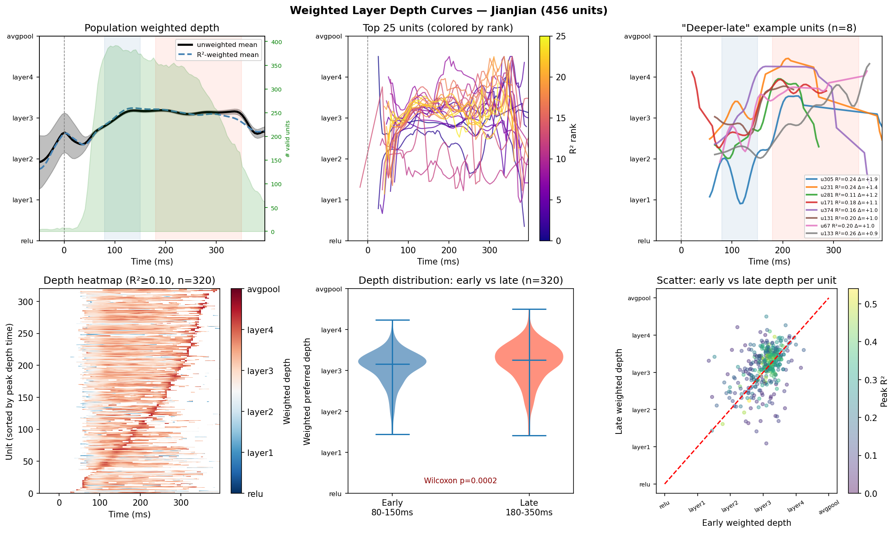
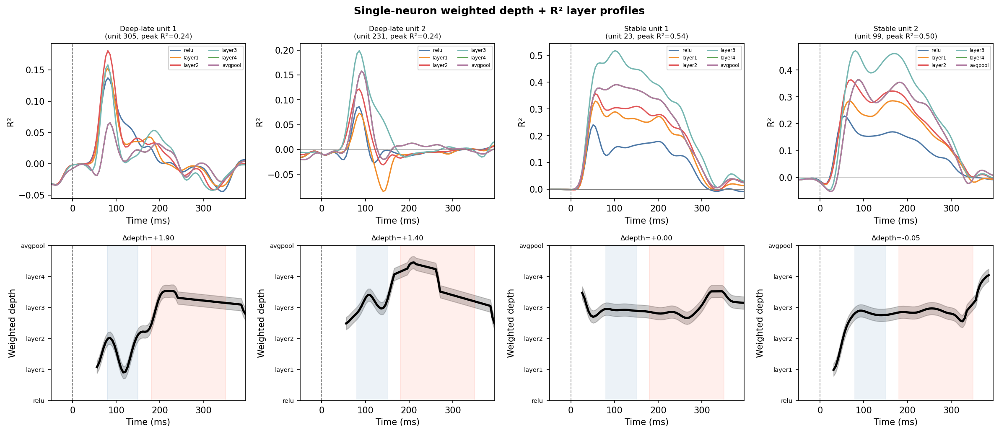
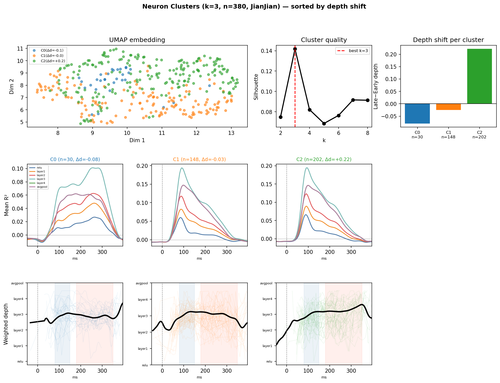
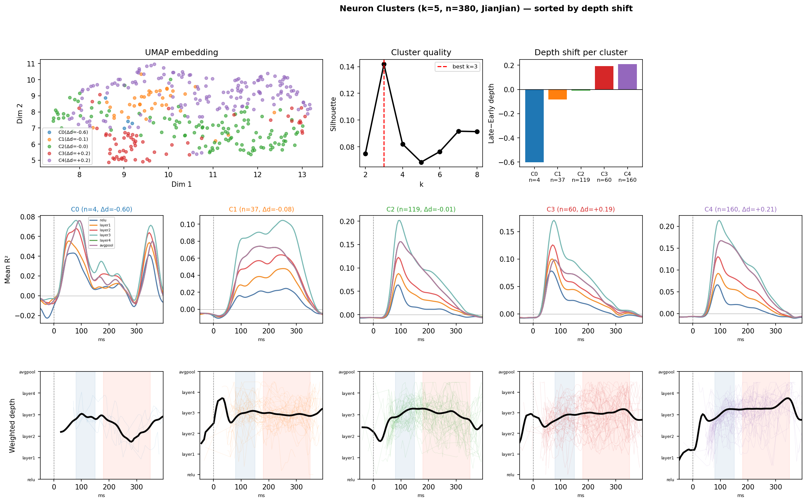

# NHP NSD Neural Encoding Dynamics Analysis

> Time-resolved regression of neural responses onto ResNet50 features, revealing how encoding properties evolve across the 400ms response window.

**Dataset:** NSD_N3 — 5 monkeys (JianJian, FaCai, TuTu, ZhuangZhuang, MaoDan), 1072 NSD images, ~248–616 units/session, LOC electrode array recordings.

---

## Pipeline Overview

```
NSD images (1072)
    ↓ ResNet50 feature extraction (6 layers)
    ↓ PCA reduction (200 dims/layer)
    ↓ RidgeCV regression → R²(layer, time, unit)
    ↓ Weighted layer depth analysis
    ↓ Temporal hierarchy test
    ↓ Unsupervised clustering
```

---

## Step 1: Feature Extraction

ResNet50 (pretrained ImageNet) features extracted at 6 checkpoints:

| Layer | Spatial size | Channels | Semantic level |
|-------|-------------|----------|----------------|
| `relu` (stem) | 56×56 | 64 | Low-level edges |
| `layer1` | 56×56 | 256 | Textures |
| `layer2` | 28×28 | 512 | Mid-level features |
| `layer3` | 14×14 | 1024 | Object parts |
| `layer4` | 7×7 | 2048 | Object-level |
| `avgpool` | 1×1 | 2048 | Global descriptor |

Spatial-average pooled before PCA (200 components, fit on 80% train split).

**Script:** `time_resolved_regression.py`
**Cache:** `cache/resnet50_nsd_features.pkl`

---

## Step 2: Time-Resolved Regression

At each time bin t (stride=5ms, window=-49 to +400ms):
- `y = response_matrix_img[:, t, :]` → shape (n_images, n_units)
- Fit `RidgeCV(alphas=logspace(-2,6,25), alpha_per_target=True)` per layer
- Record test R² per unit

**Result tensor:** `r2_perunit[layer, time, unit]` — shape (6, 90, n_units)

### Multi-monkey R² over time


> All 5 monkeys show the same temporal profile: R² rises sharply at ~80ms post-stimulus, peaks at 100–150ms (layer3 dominant), then decays. JianJian shows highest R² (456 units, more population signal).

### Per-session comparison


---

## Step 3: Weighted Layer Depth

Instead of discrete `argmax` (noisy), we compute a **continuous center-of-mass** across layers:

$$\text{depth}(t, u) = \frac{\sum_l l \cdot \max(R^2_l(t,u),\ 0)}{\sum_l \max(R^2_l(t,u),\ 0)}$$

where $l \in \{0,1,2,3,4,5\}$ indexes `[relu, layer1, layer2, layer3, layer4, avgpool]`.

**Degenerate case handling:** depth is set to `NaN` when $\sum_l R^{2+} < 0.02$ (insufficient signal). ~50% of (unit, time) bins are valid.

### Population and single-neuron depth curves



> **Panel highlights:**
> - *Top-left:* Population mean depth (unweighted and R²-weighted). Both show a small but consistent rise toward deeper layers in the late window (180–350ms).
> - *Top-center:* Top 25 units' individual depth curves — diverse temporal profiles.
> - *Top-right:* Example "deeper-late" units — depth rises from layer3 → layer4 after 150ms.
> - *Bottom-left:* Heatmap of depth across all responsive units × time, sorted by time of peak depth.
> - *Bottom-center:* Violin comparison early vs late depth distribution.

### Single-neuron examples



> Each column: one example neuron. Top row = R²(layer, time); bottom row = weighted depth curve. Left two columns show "deeper-late" neurons; right two show stable layer3 neurons.

**Script:** `weighted_depth_curves.py`

---

## Step 4: Temporal Hierarchy Test

**Hypothesis:** Later time bins (180–350ms, recurrent/feedback phase) are better predicted by deeper ResNet layers than earlier bins (80–150ms, feedforward sweep).

### Analysis

1. **Layer R² ratio** (late/early): deeper layers decay more slowly.
2. **Per-unit depth shift**: `Δdepth = late_depth − early_depth`
3. **Wilcoxon signed-rank test** on paired (early_depth, late_depth) per responsive unit.


### Results (JianJian, 456 units)

| Threshold (peak R²) | n units | Deeper-late | Same | Shallower | Mean Δdepth | Wilcoxon p |
|---|---|---|---|---|---|---|
| ≥ 0.05 | 380 | 20% | 65% | 15% | +0.05 | 0.147 |
| ≥ 0.10 | 320 | 20% | 66% | 13% | +0.10 | **0.019** |
| ≥ 0.15 | 266 | 21% | 68% | 11% | +0.16 | **0.001** |

**Population-level (weighted depth, R²≥0.10):**
- Early window: 3.08 ± 0.42 (~layer3)
- Late window: 3.19 ± 0.48 (~between layer3–layer4)
- Δ = +0.11, Wilcoxon **p = 0.0002**

**Key insight:** All layers lose R² in the late window (signal decays), but the rate of decay is layer-dependent. `relu` retains only 16% of its early R² at late times, while `layer3/layer4` retain ~35% — deeper layers are *relatively* more persistent into the recurrent response.

**Script:** `temporal_hierarchy_test.py`

---

## Step 5: Neuron Clustering

**Goal:** Identify distinct populations of neurons with different time-depth encoding behaviors.

### Features per unit
- Normalized depth curve shape over 50–380ms window (66 dims)
- Normalized R² temporal envelope (66 dims)
- Summary stats: early_depth, late_depth, Δdepth, peak R², peak latency (5 dims)
- **Total: 137 features**

### Method
1. Median imputation of NaN depth bins
2. StandardScaler normalization
3. PCA (12 components → 80% variance)
4. UMAP embedding for visualization
5. k-means, k selected by silhouette score

### Clustering results (k=3, best by silhouette)



| Cluster | n units | Peak R² | Early depth | Late depth | Δdepth | Interpretation |
|---|---|---|---|---|---|---|
| C0 | 30 | 0.16 | layer3 | layer3 | −0.08 | Weakly tuned / noisy |
| C1 | 202 | 0.25 | layer3 | layer3→4 | **+0.22** | **"Deeper-late"** — temporal hierarchy |
| C2 | 148 | 0.25 | layer3 | layer3 | −0.03 | Stable sustained IT responses |

### Finer-grained clustering (k=5)



At k=5, the "deeper-late" cluster splits into two sub-populations with different shift magnitudes, and a tiny "shallower-late" group (n=4) emerges.

**Script:** `neuron_clustering.py`

---

## Summary

| Finding | Evidence |
|---|---|
| Layer3 (mid-level features) dominates the peak response | Best layer at 100–150ms in all 5 monkeys |
| Temporal hierarchy exists but is modest | Wilcoxon p=0.0002, mean Δdepth=+0.11 |
| ~53% of responsive neurons show "deeper-late" pattern | Cluster C1, k=3 |
| Effect is stronger for well-tuned neurons (R²≥0.15) | p=0.001 vs p=0.15 at low threshold |
| Pattern is consistent across all 5 monkeys | Same layer preference curve shape |

---

## File Index

```
notebooks/
├── ANALYSIS_README.md          ← this file
├── time_resolved_regression.py ← Step 2: main regression
├── weighted_depth_curves.py    ← Step 3: depth curves
├── temporal_hierarchy_test.py  ← Step 4: hierarchy test
├── neuron_clustering.py        ← Step 5: clustering
├── run_perunit_all_sessions.py ← per-unit regression for all monkeys
├── time_resolved_multimonkey.py← multi-monkey population analysis
├── cache/
│   ├── resnet50_nsd_features.pkl          ← ResNet50 features (1072 imgs × 6 layers)
│   ├── time_resolved_perunit_{monkey}.pkl ← R²[layer,time,unit] per monkey
│   └── time_resolved_{monkey}.pkl         ← mean R² per monkey (multi-monkey analysis)
└── figures/
    ├── fig_multimonkey_R2_time.png
    ├── fig_multimonkey_best_layer.png
    ├── fig_multimonkey_comparison.png
    ├── fig_perunit_1_distribution.png
    ├── fig_perunit_2_preferred_layer.png
    ├── fig_perunit_3_heatmap.png
    ├── fig_perunit_4_per_layer_bands.png
    ├── fig_weighted_depth_curves.png
    ├── fig_single_neuron_depth.png
    ├── fig_temporal_hierarchy.png
    ├── fig_clusters_k3.png
    └── fig_clusters_k5.png
```

---

## Reproducibility

```bash
# Activate environment
conda activate torch2

# Run full pipeline (features cached after first run)
python notebooks/time_resolved_regression.py       # JianJian, produces fig_multimonkey_*.png
python notebooks/run_perunit_all_sessions.py       # All monkeys, per-unit R²
python notebooks/weighted_depth_curves.py          # Depth curves
python notebooks/temporal_hierarchy_test.py        # Hierarchy test
python notebooks/neuron_clustering.py              # Clustering
```
